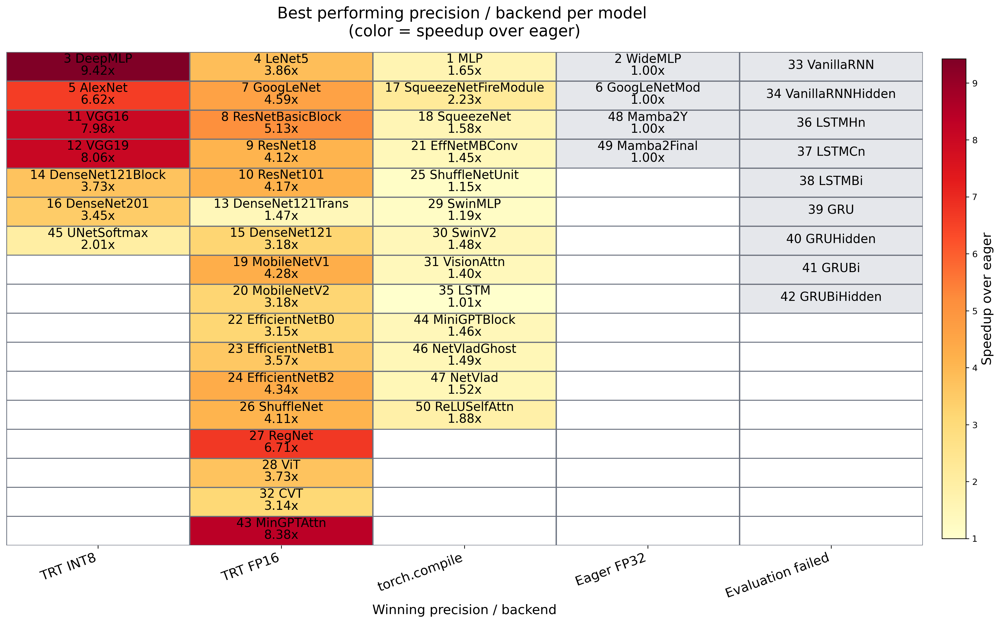

# KernelBench Precision Search

This project benchmarks mixed-precision inference deployments for KernelBench Level 3 PyTorch models on NVIDIA GPUs.

It automatically searches for the fastest numerically valid configuration using:

- `torch.compile`
- TensorRT FP16
- TensorRT BF16
- TensorRT FP8
- TensorRT INT8

For each model it:

- tests multiple deployment variants
- applies PTQ for INT8/FP8 variants
- validates outputs against PyTorch eager
- keeps the fastest valid configuration

The goal is to explore accuracy vs latency trade-offs in low-precision inference, including distribution-aware calibration and sensitive layer exclusion.


## Results

**Geometric mean** over `torch.compile` FP32 on KernelBench Level 3:

| Method                            | Geometric Mean |
|-----------------------------------|----------------|
| KernelBlaster (NVIDIA) [1]        | 1.50×          |
| CUDA Agent (ByteDance Seed) [2]   | 1.52×          |
| Precision search @ 1e-4 tolerance | 1.39×          |
| Precision search @ 1e-3 tolerance | 1.55×          |
| Precision search @ 1e-2 tolerance | 1.80×          |

So a simple precision search already gets into the same ballpark as recent SOTA systems. 
It suggests that generating kernels does not necessarily require staying in FP32 to pass the correctness check. 
Or that the tolerance might be looser than expected.

Please note that these numbers are not an apples-to-apples comparison. The hardware differs, CUDA Agent reports speedups 
only on correct solutions, and KernelBlaster also includes FP16 kernels.

[1] https://people.eecs.berkeley.edu/~chrisdong/KernelBlaster.pdf  
[2] https://arxiv.org/pdf/2602.24286

## Per-Model Results
The figure below shows the best-performing precision/backend per model on an RTX 5090 using a relaxed correctness tolerance (rtol = atol = 1e-2).
The reported speedups are **average speedup** vs **PyTorch eager**.



### Observations

- FP16 provides the best accuracy–performance tradeoff for most models
- INT8 provides the largest speedups for convolution-heavy CNN architectures
- BF16 and FP8 did not win for any model

### Speedup vs PyTorch eager

- **Average speedup:** 2.79×
- **Geometric mean:** 2.04×

## Hardware
All reported results in this repository were obtained on an RTX 5090.

## Project Files

**kernelbench_precision_search.py**

Main script that:

- loads models
- benchmarks precision variants
- validates numerical accuracy
- records results

**trt_builders.py**

TensorRT builder implementations for:

- FP16
- BF16
- FP8
- INT8

**helpers.py**

Utility functions for:

- latency measurement
- numerical comparison
- file handling
- results export

**create_figure.py**

Optional script for plotting benchmark results.

---

# Requirements

- Python 3.10+
- CUDA-capable NVIDIA GPU
- PyTorch with CUDA support
- Torch-TensorRT
- NVIDIA ModelOpt

Install dependencies:
```bash
pip install -r requirements.txt
```

This project expects **KernelBench Level 3 models** as input.  
They can be obtained from the KernelBench repository:

https://github.com/ScalingIntelligence/KernelBench

---

# Usage

Example command:

```bash
python kernelbench_precision_search.py \
  --path KernelBench/KernelBench/level3
```

---

# Output

The script produces a JSON results file which can be used in create_figure.py.

Each model record contains:

- eager FP32 latency
- torch.compile FP32 latency
- TensorRT variant performance
- numerical differences
- validity flags
- speedup vs eager
- speedup vs compiled PyTorch

Example metrics per variant:

| Field | Description |
|------|-------------|
| build_ok | model successfully compiled |
| run_ok | inference ran successfully |
| valid | output within tolerance |
| latency_ms | average inference latency |
| mean_abs_diff | mean absolute difference |
| max_abs_diff | maximum absolute difference |
| speedup_vs_eager | speedup vs eager FP32 |
| error | error message if failure |

---


# Limitations

Some models may fail to compile due to:

- unsupported operators
- multi-input models (the current harness supports only a single floating-point tensor input)
- out-of-memory

RNN/LSTM architectures can be more fragile than CNNs.

---

# License

MIT